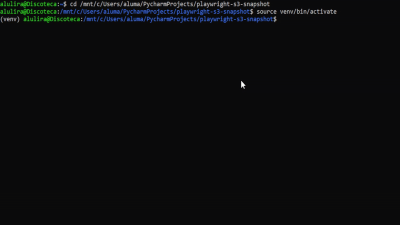

# Playwright S3 Snapshot

A powerful command-line tool and AWS Lambda function to capture, store, and manage web page snapshots on Amazon S3.

[](https://www.python.org/)
[](https://playwright.dev/)
[](https://aws.amazon.com/)
[](https://opensource.org/licenses/MIT)
[](https://pytest.org)
[](https://github.com/psf/black)
[](https://github.com/astral-sh/ruff)


## Project Overview

Playwright S3 Snapshot is a versatile tool designed for developers, QA engineers, and content managers who need to automate the process of capturing web page screenshots. It offers a dual interface: a powerful Command-Line Interface (CLI) for local and scripted tasks, and a serverless AWS Lambda function for scalable, event-driven operations. The core functionality revolves around using Playwright to render web pages accurately and Boto3 to seamlessly upload the resulting snapshots to an Amazon S3 bucket for reliable storage and easy access.

This project solves the common challenge of automating visual regression testing, website monitoring, and content archival in a way that is both cost-effective and highly scalable.

## Key Features

-   **Dual-Mode Operation**: Use it as a feature-rich CLI on your local machine or deploy it as a serverless function on AWS Lambda.
-   **S3 Integration**: Automatically uploads screenshots to a specified S3 bucket with customizable prefixes.
-   **Flexible Configuration**: Configure via command-line arguments, environment variables, or a JSON configuration file.
-   **Batch Processing**: Take screenshots of multiple URLs from a text file in a single command.
-   **Customizable Viewport**: Define custom width and height for screenshots to test different resolutions.
-   **Serverless Architecture**: Built with AWS SAM for easy deployment and scaling, including API Gateway integration.
-   **Robust Error Handling**: Includes retry logic for network-related failures.
-   **Comprehensive Testing**: High test coverage with Pytest and Moto for mocking AWS services.

## Live Demo

Below are some examples of the tool in action.

**CLI Deployment Demo:**


**Lambda API Integration Demo:**


## Tech Stack & Tools

This project is built with a modern, robust set of tools and technologies.

-   **Core Language**:
    -   
-   **Backend & Frameworks**:
    -   **Browser Automation**: 
    -   **AWS SDK**: 
    -   **CLI**: 
-   **Testing**:
    -   **Test Runner**: 
    -   **AWS Mocking**: 
    -   **Code Coverage**: 
-   **DevOps & Deployment**:
    -   **Containerization**: 
    -   **Serverless Framework**: 
    -   **CI/CD**: Makefile for streamlined development tasks.
-   **Code Quality**:
    -   **Formatter**: 
    -   **Linter**: 

## Getting Started

Follow these instructions to get a local copy of the project up and running for development and testing purposes.

### Prerequisites

-   Python 3.12+
-   pip (Python package installer)
-   An AWS account and configured AWS CLI (for S3 upload and deployment)

### Installation

1.  **Clone the repository:**
    ```sh
    git clone https://github.com/aluiziolira/playwright-s3-snapshot.git
    cd playwright-s3-snapshot
    ```

2.  **Create and activate a virtual environment:**
    ```sh
    python -m venv venv
    source venv/bin/activate  # On Windows use `venv\Scripts\activate`
    ```

3.  **Install dependencies:**
    The project uses `setuptools` for package management. Install it in editable mode along with development dependencies:
    ```sh
    pip install -e ".[dev]"
    ```

4.  **Install Playwright browsers:**
    This command downloads the necessary browser binaries for Playwright.
    ```sh
    playwright install chromium
    ```

### Usage

#### Local Screenshots

To take a screenshot and save it locally:
```sh
python -m playwright_s3_snapshot.cli https://example.com --output my-screenshot.png
```

#### Uploading to S3

To take a screenshot and upload it directly to an S3 bucket:
```sh
export AWS_ACCESS_KEY_ID="YOUR_AWS_KEY"
export AWS_SECRET_ACCESS_KEY="YOUR_AWS_SECRET"

python -m playwright_s3_snapshot.cli https://example.com --bucket your-s3-bucket-name --prefix snapshots/
```

#### Running Tests

To ensure everything is set up correctly, run the test suite:
```sh
pytest
```

## AWS Lambda Deployment

For a scalable solution, deploy the application as a serverless function using AWS SAM.

### Prerequisites

-   AWS CLI (configured with `aws configure`)
-   AWS SAM CLI
-   Docker

### Deployment Steps

1.  **Build the SAM application:**
    ```sh
    sam build --use-container
    ```

2.  **Deploy to AWS:**
    ```sh
    sam deploy --guided
    ```
    Follow the on-screen prompts to name your stack and provide parameters like the S3 bucket name. The `deploy.sh` script provides a convenient wrapper for this process.

### API Usage

Once deployed, you can trigger the Lambda function via its API Gateway endpoint:

```sh
curl -X POST https://<your-api-id>.execute-api.us-east-1.amazonaws.com/Prod/screenshot \
-H "Content-Type: application/json" \
-d '{
  "url": "https://www.amazon.com",
  "width": 1920,
  "height": 1080
}'
```

## License

This project is licensed under the MIT License. See the `LICENSE` file for details.

## Contact

Aluizio Lira - [in/aluiziolira](https://www.linkedin.com/in/aluiziolira) - alumlira@gmail.com

Project Link: [https://github.com/aluiziolira/playwright-s3-snapshot](https://github.com/aluiziolira/playwright-s3-snapshot)
